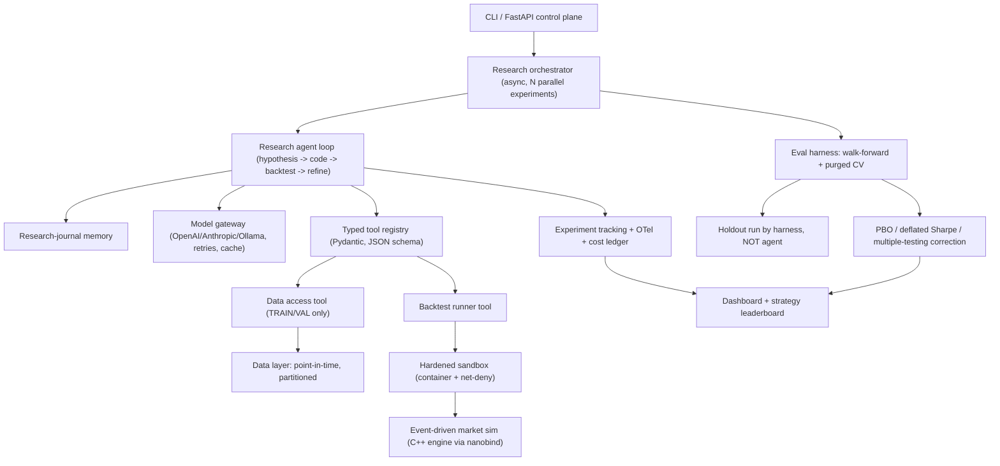

# Alphaforge

**An autonomous quant-research agent harness.**

Alphaforge drives an LLM agent through the real research loop — form an alpha
hypothesis, write signal/strategy code, backtest it in a sandbox, read the
metrics, and refine — and then a rigorous **evaluation protocol** measures
*out-of-sample* robustness while actively fighting the failure modes that make
most "AI finds alpha" work worthless: **lookahead bias, data leakage, and
multiple-testing p-hacking**.

The thesis is deliberately *"a harness that resists fooling itself,"* not "AI
prints money." The headline metric is therefore honest:

> Of `N` strategies the agent generated, `X%` survived a held-out test set
> *after* multiple-testing correction, with a Probability of Backtest
> Overfitting (PBO) of `Y`.

## Why this is not a toy

- **The backtest sim core is a real C++ matching engine.** Alphaforge vendors
  [`HFTMatchingEngine`](https://github.com/SFXNK/HFTMatchingEngine) and extends
  it with a timestamp-ordered event loop, market orders, a queue-position fill
  model, and a portfolio/PnL layer, then binds it to Python with `nanobind`.
  Execution realism (queue priority, partial fills, slippage, market impact) is
  first-class instead of faked.
- **Backtest integrity is the centerpiece.** Point-in-time data access, a
  holdout set the agent can never see, purged + embargoed cross-validation, and
  overfitting statistics (PBO, Deflated Sharpe Ratio) are built into the eval
  harness.
- **Sandboxed execution.** Agent-written strategy code runs in a hardened,
  network-denied container — which doubles as a leakage guard (no peeking at
  future data over the network).

## Architecture



See [`docs/DESIGN.md`](docs/DESIGN.md) for the full design.

## Layout

```
src/alphaforge/      Python package (agent, tools, sandbox, eval, data, sim adapter, obs)
sim_core/            C++ market simulator extending HFTMatchingEngine + nanobind bindings
external/            Git submodule for HFTMatchingEngine (vendored, unchanged)
tests/               Test + integrity suite
scripts/             Smoke runs and demos
docs/                Design docs
```

## Quickstart (Linux / WSL2 recommended)

```bash
# 1. Python environment
uv sync --extra dev --extra sandbox

# 2. (Optional) build the native C++ sim core. Without this, Alphaforge falls
#    back to a pure-Python reference simulator so everything still runs.
git submodule update --init --recursive
cmake -S sim_core -B sim_core/build -DCMAKE_BUILD_TYPE=Release
cmake --build sim_core/build -j
# copy/symlink the produced module onto the path, e.g.:
#   cp sim_core/build/*.so src/alphaforge/sim/

# 3. (Optional, free) a local model for the agent
ollama pull qwen2.5-coder:7b

# 4. Run the test + integrity suite
uv run pytest

# 5. Smoke research run (uses the offline echo model by default -> $0)
uv run alphaforge research --experiments 4 --model echo

# 6. Launch the dashboard
uv run alphaforge dashboard
```

> **Platform note:** the hardened sandbox and the C++ build target Linux
> primitives (seccomp, cgroups v2, namespaces). On Windows use WSL2. The
> pure-Python paths run anywhere.

## Cost model

Develop and CI on the free **echo** model (deterministic, offline) or a local
**Ollama** model. Spend on hosted models (OpenAI/Anthropic-compatible) only for
the final headline numbers. All model responses are cached by prompt hash so
re-runs are free.

## License

MIT.
